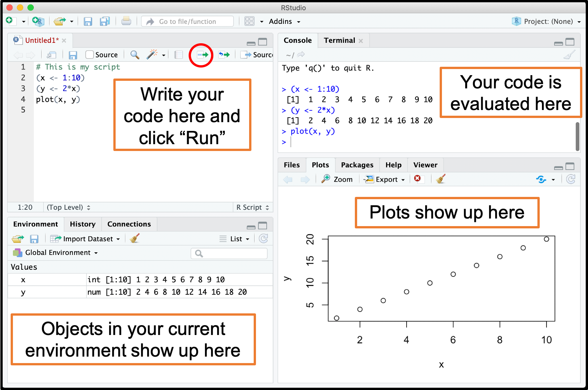
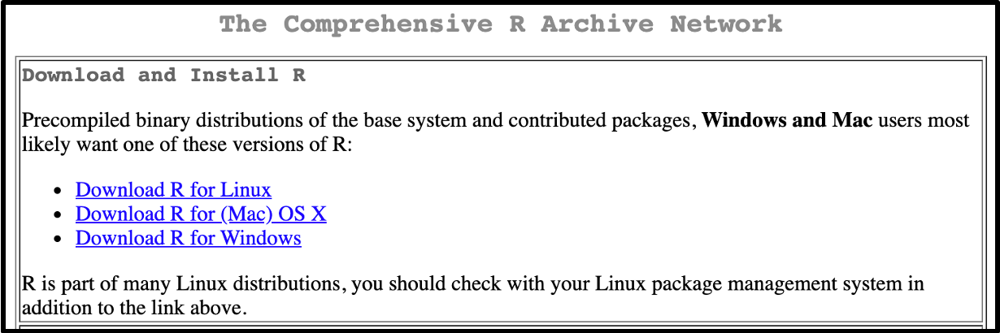

## 1 \  What is R? {#r}

**R** is a programming language and free software environment for statistical computing. When you open R, you will see a console where you can type commands and see the result.  

## 2 \  What is RStudio? {#rstudio}

If you are familiar with programming, you may already know that it is much easier to write code with the help of a script editor that applies automatic formatting depending on what you type. **RStudio** is an IDE (integrated development environment) for R. It includes a script editor, and many other features that will make programming in R much easier. Once you install RStudio, there is no reasons to ever open R again!

RStudio includes four panels:

* **Source editor**: Functions as a text editor for writing scripts
* **Console**: A place to type and execute code immediately (equivalent to using R)
* **Workspace browser**: Lists all objects loaded in your current workspace (or environment)
* **Plots**: Shows your plot history by default, but can also be used to navigate through files on your computer and view R documentation

## 3 \  Installation {#install}

### 3.1 \  Install R

+ Go to https://cran.rstudio.com/

+ Click either **Download R for (Mac) OS X** or **Download R for Windows** depending on your operating system
    

      
####  Mac users
Click the link to the .pkg file with the lastest release of R. You will also need to click the link to download and install **XQuartz**.

        
#### Windows users

Click the link to **install R for the first time**. You will be redirected to a page with a link to download the lastest version of R. 

### 3.2 \  Install RStudio Desktop

+ Go to https://rstudio.com/products/rstudio/download/#download

+ Click the link to download and install the appropriate version depending on your operating system

