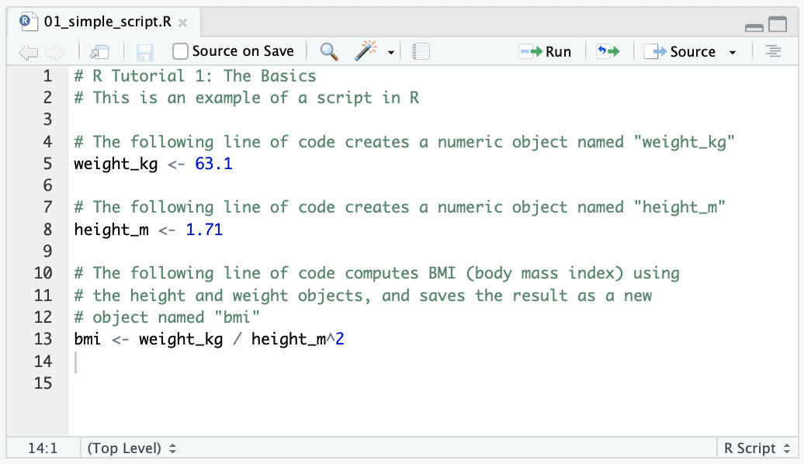
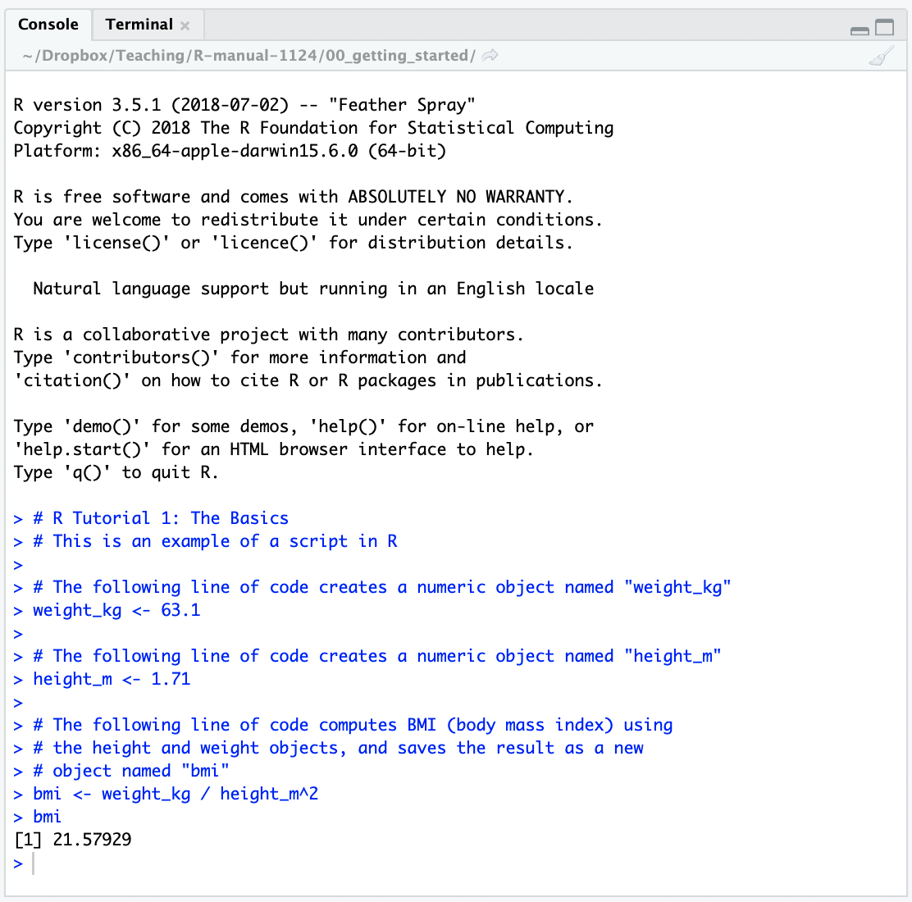
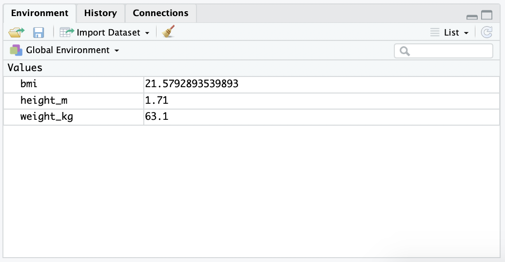
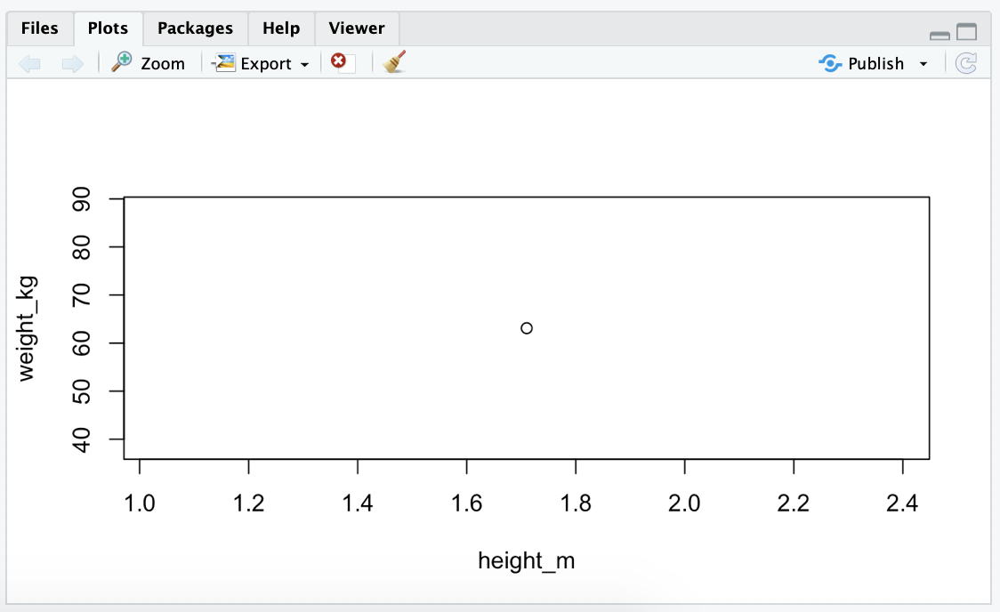
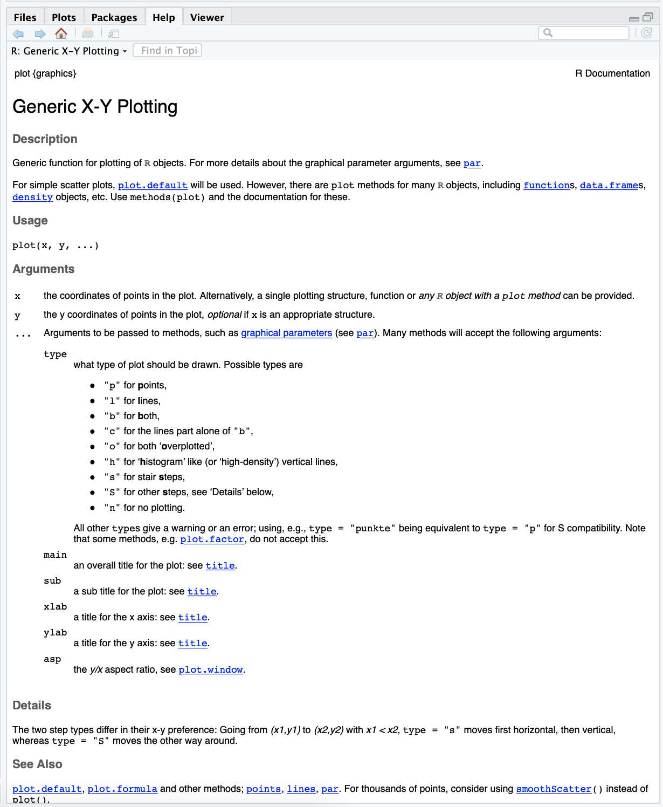

## Learning Objectives:

* Understand the uses for each of the four panes in RStudio
* Understand basic R syntax, including object assignment and comments
* Run code from an R script and see the result in the console 
* Assign values to arguments inside R functions 
* Access R help documentation for functions 

## 1 \  RStudio panes {#panes}

### 1.1 \   Source editor {#source}

This is where you write and modify scripts that you can save for later. Let's start by opening an existing script file named *01_simple_script.R*. You can open a script by double-clicking the file name. 

#### File Associations
When you open a saved R script, you want the file to launch in RStudio, rather than R. To do this, create a default association between RStudio and .R files. For Mac users, use the *Get Info* option by right-clicking on any .R file and change the *Open With* program. Windows users can find default program settings in the control panel. 

Close RStudio and re-launch it by double-clicking the *01_simple_script.R* file. You should see the following code in your RStudio script editor:


#### Comments
Lines that start with ``r "#"`` are comments. It is a good idea to write comments to organize your script. 

#### Object assignment
You can use the ``r "<-"`` operator to assign objects to variable names. The code ``r "weight_kg <- 63.1"`` assigns the number 63.1 to a variable named ``r "weight_kg"``. You can use any variable name you like as long as there are no spaces or special characters. There are many different types of objects (numeric, character, logical, etc.), and R will automatically determine the object type based on the value of the variable. The variable ``r "weight_kg"`` is numeric. If you want to create a character string object, you must surround the text in quotations. For example ``r 'name <- "David"'`` creates the the variable  ``r "name"`` with value ``r "David"``. 

#### Arithmetic operations
You can use R to add (``r "2 + 2"``), subtract (``r "2 - 2"``), multiply (``r "2 * 2"``), divide (``r "2 / 2"``), and more. You can perform arithmetic operations on numeric variables you have already created. For example ``r 'weight_kg / height_m^2'`` computes $63.1/1.71^2$. 

#### Running code
Run the first line of code by moving your cursor to ``r "weight_kg <- 63.1"``. Click **Run** in the top right corner of the script editor. You can also press **ctrl** (or **command**) **+ enter** to run a line of code. This will only run the single line of code where your cursor is active. You can run the entire script by highlighting all of the code and then clicking Run (or using the keyboard shortcut).

The evaluated code will appear in the console pane.


### 1.2 \   Console {#console}

You can type and execute code immediately in the console. This is useful for doing quick calculations and writing code that you do not wish to save for later. 

By running all of the code in *01_simple_script.R*, we created a variable named  ``r "bmi"``. To see its value, type ``r "bmi"`` in the console and press **enter** to run the code. The number 21.57929 should appear in the console. 




### 1.3 \  Workspace browser (and more) {#ws}

The workspace browser lists all objects loaded in your current workspace (or environment). You should see the objects we created earlier (``r "bmi"``, ``r "height_m"``, ``r "weight_kg"``) and their values.




### 1.4 \  Plots (and more) {#plots}

The final pane shows your plot history by default, but can also be used to navigate through files on your computer and view R documentation. 

Let's create a simple scatterplot with a single point. Type this code in your console and hit enter:
```{r, eval=F}
plot(x = height_m, y = weight_kg)
```

\


## 2 \  Functions

The command ``r "plot()"`` is an example of a function. Functions always have a name followed by brackets. The use of brackets, even without anything inside of them, is how R distinguishes functions from other objects. Functions perform an action, while other types of objects only store information. 

Most functions have one or more named arguments inside the brackets (``r "x, y, ..." ``) that you can assign values to using the ``r "="`` operator. Arguments are separated by commas. The following lines of code create a scatterplot with a single point at (1.71, 63.1). Try them out to see the result. \
```{r, eval=F}
# You can assign the named arguments to our height_m and weight_kg variables 
plot(x = height_m, y = weight_kg)

# The function plot() expects the "x" argument to be assigned first, followed by the "y" argument. If you do not name the arguments, the function will automatically assume they are listed in the same order they appear in the R documentation. 
plot(height_m, weight_kg)

# If you always name the arguments, it doesn't matter which order they appear inside the function.
plot(y = weight_kg, x = height_m)

# If you do not name the arguments, you may get an unexpected result. In this plot, "weight_kg" is on the x-axis because it is the value of the first unamed argument inside the function.
plot(weight_kg, height_m)

# You do not have to use variables as arguments to your function. You can use numeric values. One disadvantage of this is that the axes do not have meaningful names by default. 
plot(1.71, 63.1)

# You can define more arguments inside the plot() function to add labels. You do not have to name all arguments inside the function, but it is a good habit to name arguments that appear farther down the list of expected arguments.
plot(1.71, 63.1, xlab = "Height (m)", ylab = "Weight (kg)", main = "Scatterplot of height versus weight")

# You can separate your code onto multiple lines (press enter to start a new line) to make long functions easier to read
plot(1.71, 63.1,
     xlab = "Height (m)", ylab = "Weight (kg)",
     main = "Scatterplot of height versus weight")
```

#### Help
To learn more about any function and its possible arguments, type ``r "?"`` followed by the function name in the console and press enter. R documention will appear in the plot pane. 
```{r, eval=F}
?plot
```




