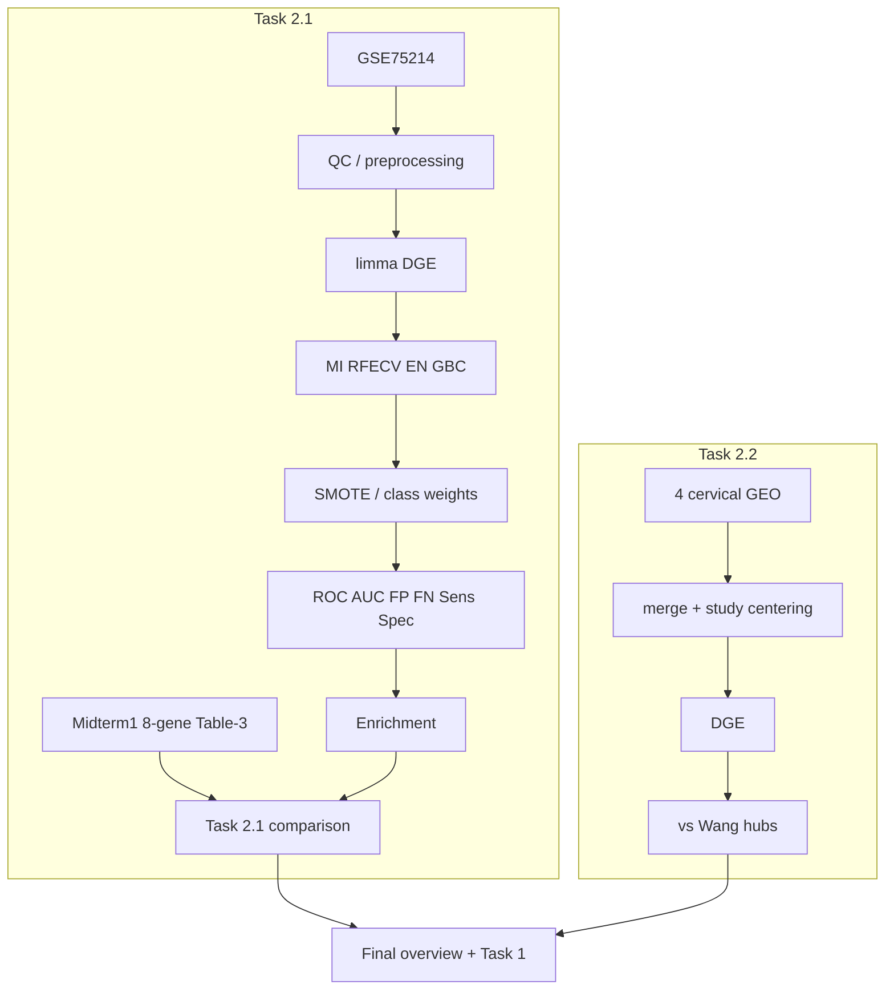

# Plan por etapas — Final Exam DANA 4830

Trabajar **solo** en [`assigment 1/final exam/Final_exam_my_version`](assigment 1/final exam/Final_exam_my_version). Chris es consulta de método. [`DANA4830_Final_Exam_Leonardo`](assigment 1/final exam/DANA4830_Final_Exam_Leonardo) queda archivado; no mezclar notebooks.

El Midterm 1 calificado vive en [`midtermn/03_Answer`](midtermn/03_Answer).

El pipeline analítico ya existe: 6 notebooks + HTML + [`report_data.json`](assigment 1/final exam/Final_exam_my_version/04_Analysis/report_data.json). El objetivo **no es reconstruirlo** sino corregirlo, justificarlo, conectarlo con Rosati/Syed y dejarlo defendible.

**Números oficiales** (fuente `report_data.json`, no Chris): 535 DEGs IBD; 8 genes Midterm 1 Table-3; 0 overlap ML ↔ MT1; merged cervical 12,193 genes; 381 DEGs; 10/10 Wang hubs.

## Qué no hacer

- No copiar Task 1.1 de Chris ni re-entregar Leonardo.
- No re-correr feature selection del Midterm 1 para “mejorar” el panel (RFECV/GBC estocásticos). Citar el notebook calificado.
- No reemplazar limma por edgeR/DESeq2/NOISeq/SAMseq en Task 2.1: GSE75214 son **intensidades de microarray**, no raw RNA-seq counts.
- No implementar VAE en el camino crítico.
- No usar `--clean` en [`run_all.py`](assigment 1/final exam/Final_exam_my_version/03_Codes/run_all.py) hasta Etapa 8, cuando 0–7 estén verdes.
- No mezclar el panel de 11 genes (votes ≥ 2) con el de 8 genes Table-3.

## Jerarquía de esfuerzo

- **MUST:** provenance, limma DGE, FDR, MI/RFECV/EN/GBC, SMOTE solo en train, ROC/AUC, FP/FN + sensitivity/specificity, enrichment, comparación MT1, Wang.
- **SHOULD:** nota TMM, tabla comparativa edgeR/DESeq2/NOISeq/SAMseq/limma, PCA exploratorio, glosario, limitaciones (centering ≠ ComBat).
- **OPTIONAL:** VAE, clasificadores extra, re-ejecutar DGE alternativos.

---

## Etapa 0 — Congelar insumos (sin re-correr notebooks)

Panel oficial (notebook calificado `table3_master_bc`): `AC083967.1, AC108477.1, AC112777.1, AL356275.1, ARHGAP16P, CST4, SLC6A2, TRPM3`.

- Corregir [`export_mt1_data.py`](assigment 1/final exam/Final_exam_my_version/03_Codes/export_mt1_data.py): hoy `r.get("FDR", ...)` deja **FDR = 1.0** en [`midterm1_biomarkers.csv`](assigment 1/final exam/Final_exam_my_version/01_Data/midterm1_biomarkers.csv). Mapear la columna real de `deg_table`.
- Añadir [`01_Data/midterm1_biomarkers_PROVENANCE.md`](assigment 1/final exam/Final_exam_my_version/01_Data/midterm1_biomarkers_PROVENANCE.md): el panel de 8 genes sale del Midterm 1 calificado, no de una nueva ejecución.
- Papers en [`05_References`](assigment 1/final exam/Final_exam_my_version/05_References): Rosati 2024 (ya abierto), Syed 2024, Wang 2022; PDF del enunciado en `02_Question/` (hoy vacío).
- **Nuevo:** [`04_Analysis/dge_methods_notes.md`](assigment 1/final exam/Final_exam_my_version/04_Analysis/dge_methods_notes.md) — contexto para Task 1 / defensa, **no** código de Task 2.1:

| Método | Normalización / modelo | Tipo |
|--------|------------------------|------|
| edgeR | TMM + Negative Binomial | RNA-seq |
| DESeq2 | Median-of-ratios + Negative Binomial | RNA-seq |
| NOISeq | noise / non-parametric | RNA-seq |
| SAMseq | rank / resampling | RNA-seq |
| limma | linear models / empirical Bayes | microarray |

Frase de defensa: *Rosati discusses multiple DGE strategies, but GSE75214 is analyzed with limma because the available data are microarray expression values rather than raw RNA-seq counts.*

**Salida:** CSV con FDR real; provenance; papers listados; `dge_methods_notes.md`.

---

## Etapa 1 — Figuras Task 1.2 + mini-glosario visual

Actualizar [`make_diagrams.py`](assigment 1/final exam/Final_exam_my_version/03_Codes/make_diagrams.py). Hoy `04_Analysis/figures/` está vacío.

**Diagram 1 — Rosati** (flujo explícito): Raw omics → QC/preprocessing → Normalization → Differential expression → Candidate DEGs → Pathway enrichment → ROC/AUC → Survival analysis → Potential biomarkers.

Dentro de Differential expression, **ejemplos** (no ejecutar los cuatro):

- RNA-seq: edgeR→TMM; DESeq2→median-of-ratios; NOISeq; SAMseq
- Microarray: limma

**Diagram 2 — Syed / Midterm:** High-dimensional genes → statistical filtering/DEG → ML feature selection → reduced candidate set → classifier. Debe ser **tu** `syed_pipeline`, no el de Chris.

**Nueva mini-figura TMM** (`diagram_tmm_normalization.png`): Sample A 10M vs Sample B 20M → raw counts not comparable → TMM (trim extreme M/A, scaling factor) → effective library sizes → comparable expression.

Mensaje a defender: *TMM does not simply divide every gene by the total number of reads. It estimates a robust scaling factor after excluding genes with extreme expression differences.* No derivar la fórmula en el examen.

También verificar volcano / ROC / PCA / enrichment de los notebooks.

**Salida:** diagram1, diagram2, figura TMM, plots Task 2.

---

## Etapa 2 — Integridad vs Chris

Correr [`sync_notebook_numbers.py`](assigment 1/final exam/Final_exam_my_version/03_Codes/sync_notebook_numbers.py); parchear con [`patch_notebook_text.py`](assigment 1/final exam/Final_exam_my_version/03_Codes/patch_notebook_text.py) si hace falta.

Eliminar narrativas heredadas: 502 DEG, 21 genes, ANXA1, 11,575 genes. Números desde `report_data.json` o dataframes.

Narrativa correcta: *None of the eight Midterm-1 breast-cancer biomarkers were recovered as IBD DEGs.* Eso **no** significa que el Midterm estuviera mal: *biomarker transferability across diseases is limited.*

**Salida:** script en verde; historia 0/8, no ANXA1.

---

## Etapa 3 — Task 2.1 (método correcto, no más DGE tools)

No reescribir el pipeline; auditar y anotar.

**2.1.1 DGE** — GSE75214 → **limma**. No DESeq2/edgeR/NOISeq/SAMseq en código. Mencionar en markdown que esas alternativas son para count-based RNA-seq.

**2.1.2 Feature selection** — MI, RFECV, Elastic Net, GBC, luego consenso. Mensaje central: *DGE reduces biological search space; ML reduces predictive feature space.*

**2.1.3 Imbalance** — SMOTE + class weights porque 172 vs 22. Precaución de defensa: *SMOTE must be applied only to the training data, never before the train/test split.*

Survival Rosati: N/A (GSE75214 sin follow-up). AUC del panel ML marcado como **optimista** (FS + CV en los mismos datos).

**Salida:** notebooks 2_1_* alineados con `panel_comparison_2_1.csv` (0 / 36 / 0 / 3 de 8).

---

## Etapa 3B — FP/FN y evaluación clínica (en 2_1_03)

Añadir matriz de confusión (TP/FP/FN/TN) y texto corto:

- **FP:** predice positivo cuando no lo es → pruebas extra, costo, ansiedad, tratamiento innecesario.
- **FN:** pierde un positivo real → enfermedad no detectada, retraso diagnóstico.
- Sensitivity = TP / (TP+FN); Specificity = TN / (TN+FP).
- ↓ FN → ↑ sensitivity; ↓ FP → ↑ specificity; **no** se minimizan ambos libremente (trade-off) → por eso ROC + AUC (umbrales).

---

## Etapa 3C — FDR vs FP/FN

Dos problemas relacionados, no idénticos:

- **Durante DGE:** miles de hipótesis → FDR / adjusted p (Benjamini-Hochberg) para limitar falsos descubrimientos (20k genes → muchos p&lt;0.05 por azar).
- **Durante clasificación:** FP, FN, sensitivity, specificity, ROC, AUC.

**Salida:** una celda markdown en 2_1_03 (o notes) que deja esta distinción explícita.

---

## Etapa 4 — Task 2.2

Mantener: 179 muestras, 12,193 genes, study-wise centering, 381 DEGs, 10/10 Wang hubs.

Limitación explícita: *Study-wise centering reduces dataset-specific shifts but is not equivalent to a complete batch-effect model such as ComBat.*

Wang intersectó DEGs **por estudio**; aquí se unen muestras **primero** y luego DGE. Por tanto 10/10 hubs = external concordance / benchmark, **no** réplica exacta.

`2_0_final_overview.ipynb` lee solo `report_data.json`.

---

## Etapa 5 — Dimensionality reduction (VAE opcional)

**No** implementar VAE de forma obligatoria. Mencionar en Task 1 como posibilidad: PCA (lineal) vs VAE/autoencoder (no lineal).

Por qué no VAE ahora: encoder/decoder, latent space, reconstruction + KL, hiperparámetros; y **rompe interpretabilidad del biomarcador** (latent 17 ≠ gen AURKA). Es más defendible: 12k → DGE → 535 → MI/RFECV/EN/GBC → panel pequeño.

**PCA:** sí, como visualización / exploratory DR, no como feature-selection principal.

---

## Etapa 6 — Task 1.1 (~300 palabras)

Cuatro diferencias, no una lista de software:

- **Rosati:** statistical/bioinformatics → qué genes son DE → interpretación, pathways, ROC, survival.
- **Syed:** ML → qué subset predice → FS, dimensionality reduction, classification, imbalance.
- **Conclusión:** no compiten necesariamente; se combinan: DGE (filtro biológico/estadístico) → ML (reducción predictiva) → ROC/validation → candidate biomarker.
- **Evidencia tuya:** *GSE75214 generated 535 IBD DEGs, while none of the eight Midterm-1 breast-cancer biomarkers overlapped with the IBD DEG set* (disease specificity / limited transferability).

Usar [`task1_1_comparison_STUDY_NOTES.md`](assigment 1/final exam/Final_exam_my_version/04_Analysis/task1_1_comparison_STUDY_NOTES.md) como notas, no como texto final. Inglés del curso.

---

## Etapa 7 — Informe final + glosario

Regenerar Word con [`build_final_report.py`](assigment 1/final exam/Final_exam_my_version/03_Codes/build_final_report.py); actualizar [`README.md`](assigment 1/final exam/Final_exam_my_version/README.md).

Appendix corto (10–12 términos): DEG, TMM, log2FC, FDR, SMOTE, TP, FP, FN, Sensitivity, Specificity, ROC, AUC. No un glosario enorme.

---

## Etapa 8 — Empaque y defensa oral

`python run_all.py` **sin** `--clean` primero. Zip **sin** carpetas Chris ni Leonardo.

Checklist:

- **DGE:** Why limma not DESeq2? What is TMM? TMM vs DESeq2 normalization? Why control FDR?
- **ML:** Why feature selection? Why SMOTE? Where must SMOTE be applied? Why can AUC be optimistic?
- **Clinical/stats:** FP vs FN? Sensitivity vs specificity? Why not minimize both? What does an ROC threshold change?
- **Dimensionality:** Why no VAE? PCA vs VAE? Why can VAE hurt biomarker interpretability?
- **Biology:** Why 0/8 overlap? Does 0 mean Midterm was wrong? Why isn’t AUC ≈ 0.99 enough clinically?
- **Task 2.2:** What is batch effect? Did you really run ComBat? Why 10/10 is not exact replication?

---

## Orden de iteración

En Agent mode empezar por **Etapa 0**, parar, y continuar con “sigue etapa 1”. No gastar tiempo en VAE: queda más sólido saber **cuándo no usarlo**.
